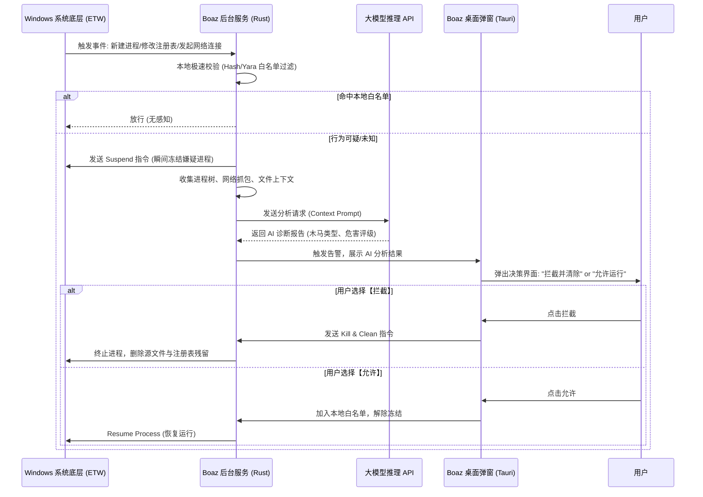

# Boaz V2.0 白皮书：AI 驱动的零信任端点智能哨兵系统

作者：Samuel · 2026-02-24

---

## 1. 执行摘要 (Executive Summary)

传统的离线审计虽然具备极高的置信度，但缺乏实效性与交互性。Boaz V2.0 完成了从「被动取证」到「主动防御（EDR）」的范式转移。

它以极其轻量级的 Rust 系统服务常驻于 Windows 环境，实时监听文件系统、注册表和网络连接的底层事件。结合大语言模型（LLM）的深度推理能力，Boaz 能够在一微秒内冻结可疑进程，并将复杂的进程树、网络外连等晦涩的机器行为翻译为人类可读的「黑客攻击意图」，交由系统管理员或用户进行最终裁决。

---

## 2. 核心架构与设计哲学 (Core Philosophy)

Boaz V2.0 遵循 **「白盒化监控 + AI 研判 + 人机共生」** 的设计哲学：

- **不越俎代庖**：系统只做拦截和建议，最高决策权（Kill or Allow）始终掌握在人类（用户/CTO）手中。
- **知其然，知其所以然**：告别传统杀毒软件只会报「发现 Trojan.Win32」的黑盒模式。Boaz 会通过大模型告诉你：「该程序在后台伪装成 svchost，正尝试将你桌面上的文档打包，并准备发送至一个俄罗斯的未知 IP。这符合典型的勒索/窃密软件行为模式。」

---

## 3. 系统宏观架构 (System Architecture)

系统被重构为三个高度解耦的层级：

### 3.1 探针感知层 (The Sensor - Ring 0 / Ring 3)

- **ETW (Event Tracing for Windows) 引擎**：摒弃容易导致蓝屏的传统底层驱动（Minifilter），使用微软官方的 ETW 机制。以极低的性能损耗，实时捕获进程创建、模块加载（DLL 注入）、网络连接建立等核心事件。
- **微隔离沙箱**：当探针发现未知程序的异常行为时，第一时间调用 `NtSuspendProcess` 将目标进程挂起（冻结），而不是直接删除，为 AI 研判争取时间。

### 3.2 混合智脑层 (The Brain - Local + Cloud AI)

- **本地敏捷引擎 (Local Heuristic)**：基于 Yara 规则和云端黑白名单 Hash 库，对已知威胁进行微秒级秒杀，拦截 90% 的已知噪音。
- **大模型研判中枢 (LLM Analyzer)**：对于本地无法判定的行为，提取上下文（进程名、父进程是谁、写入了什么注册表、连了什么 IP），构建 Prompt，通过 API 发送给大模型进行深度逻辑分析，甚至预测其所属的木马家族（如 AsyncRAT, Cobalt Strike）。

### 3.3 交互与决策层 (The UI - User in the Loop)

- **系统托盘守护**：极简的绿盾/红盾图标。
- **语义化告警弹窗 (Interactive Toast)**：弹出由 AI 生成的通俗易懂的威胁分析报告，并提供明确的处置按钮：【一键绞杀并清除残留】、【加入白名单】、【进入隔离沙箱运行】。

---

## 4. 核心执行流程图 (Execution Flow)

---

## 5. 技术栈与工程结构 (Technology Stack V2.0)

### 核心守护进程 (boaz-daemon)

- **语言**：Rust
- **关键 Crate**：
  - `windows-service`：将程序注册为 NT 服务，开机自启防杀
  - `ferrum` / `sysinfo`：监控进程树状态
  - `netstat2` / `pcap`：底层网络连接与流量阻断

### 大模型桥接模块 (boaz-ai-bridge)

- **功能**：将底层系统参数组装为大模型可理解的 Prompt，通过 HTTP Client（如 `reqwest`）异步调用大模型 API（如 Gemini 3.1 Pro 或自研 Jachin 接口）。

### 用户交互端 (boaz-agent-ui)

- **框架**：Tauri (Rust + React/Vue) 或 Win32 Native UI（保持极小体积）
- **通信**：前后端通过命名管道 (Named Pipes) 或本地 WebSocket 进行 IPC 通信，确保 UI 能够实时收到后台服务发来的拦截弹窗指令。

---

## 6. 演进路线与具体目标

### Phase 1：流量与进程感知（当前首要任务）

实现基于 Rust 的后台进程监控，能够实时抓取「谁在向外发数据」。

### Phase 2：挂起与 AI 审讯

实现进程挂起功能，并将嫌疑进程的特征码推给大模型进行语义化定性。

### Phase 3：联动与自愈

用户点击「拦截」后，不仅杀死进程，还能自动回溯其行为，删除其创建的隐藏文件和启动项。

---

## 7. 产品愿景与 UX 原则

详见 [PRODUCT-VISION.md](PRODUCT-VISION.md)，核心要点：

- **咽喉点狙击**：Boaz 只查自启动、服务、计划任务、内核文件，几百毫秒扫完是降维打击，非 BUG
- **管「管家」不管的事**：商业级监控软件有合法签名，传统杀毒放行；Boaz 结合 AI 看行为意图
- **三级风险卡片**：🔴 严重威胁 / 🟡 可疑异常 / 🟢 已知安全；默认隐蔽技术细节，结论导向
